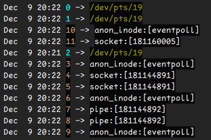

## 一些问题

~~~shell script
0 # 标准输入
1 # 标准输出
2 # 标准错误
3 # epollfd [mainReactor]
4 # listenfd
5 # listenfd [dupfd]
6 # epollfd [go runtime netpoll]
7 # pipe [go runtime netpoll]
8 # pipe [go runtime netpoll]
9 # epollfd [subReactor]
10 # epollfd [subReactor]  
11 # acceptFd
~~~

