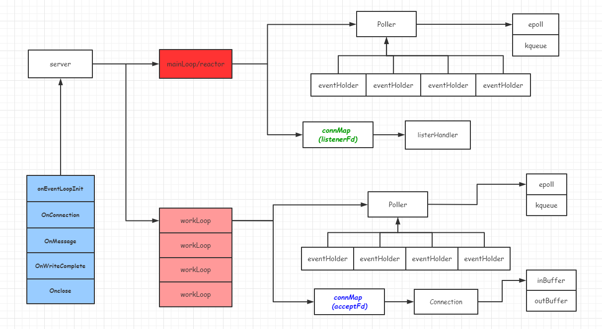

## 总体架构

mdgo是一个基于事件循环的网络库，遵循reactor模型。是`mainReactor+subReactor`模式。`mainReactor`负责检测监听`socket`。当监听`socket`可读，则将已连接套接字，投递给`subReactor`。因为遵循`一个线程(go协程)一个事件循环`，因而避免了共享资源竞争，将锁的开销降低到最低。

### server.go

~~~go
type Server struct {
	started       atomic.Bool    // 标明服务器是否启动
	option        *Option        // 配置选项
	handler       Handler        // 回调句柄
	codec         Codec          // 编解码器 ??? 是否可以放到 EventLoop 减少锁开销
	mainLoop      *EventLoop     // mainReactor
	workLoops     []*EventLoop   // subReactor
	nextLoopIndex int            // workLoop索引
	wg            sync.WaitGroup // 同步
}
~~~
这个结构体是`mdgo`的核心。包含3个核心函数：

1. 新建服务器
2. 服务器启动
3. 服务器停止

2个私有函数：
1. 获取下一个`eventLoop`
2. 当新的`acceptFd`到来的回调处理

### listener.go / connection.go

在`mdgo`中，`listener`和`connection`是平级的关系。
